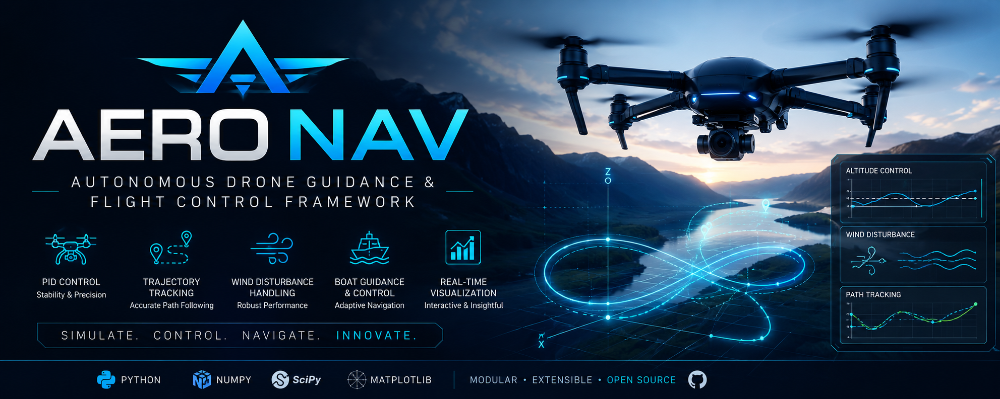

# <p align="center">AeroNav</p>

<p align="center">
  
</p>

<p align="center">
  <strong>Autonomous Drone Guidance & Flight Control Framework</strong>
</p>

<p align="center">


</p>

---

## ✨ Overview

**AeroNav** is a modern autonomous drone simulation framework built entirely in Python. It demonstrates real-world flight control concepts including **PID control**, **trajectory tracking**, **waypoint navigation**, **wind disturbance modeling**, and **interactive flight visualization**.

Designed with a modular architecture, AeroNav provides an educational and extensible platform for robotics enthusiasts, developers, and researchers interested in autonomous aerial systems.

---

# 🎬 Demo

<p align="center">

</p>

---

# 📸 Screenshots

| Drone Altitude Control | Figure-8 Tracking |
|:----------------------:|:-----------------:|
|  |  |

| Boat Guidance | Flight Analytics |
|:-------------:|:----------------:|
|  |  |

---

# 🚀 Features

- ✈️ Autonomous Drone Flight Simulation
- 🎯 PID Flight Controller
- 🌪️ Wind Disturbance Simulation
- 📍 Waypoint Navigation
- ♾️ Figure-8 Trajectory Tracking
- 🛥️ Autonomous Boat Guidance
- 📈 Real-Time Flight Analytics
- 🎬 Interactive Animation
- 🧩 Modular Software Architecture
- 📊 Performance Visualization
- 🐍 Pure Python Implementation

---

# 🏗️ Project Architecture

```
AeroNav
│
├── assets/
│
├── src/
│   ├── controllers/
│   ├── dynamics/
│   ├── guidance/
│   ├── trajectory/
│   ├── visualization/
│   └── utils/
│
├── examples/
├── tests/
│
├── main.py
├── requirements.txt
└── README.md
```

---

# ⚙️ Installation

Clone the repository

```bash
git clone https://github.com/yourusername/AeroNav.git
```

Move inside the project

```bash
cd AeroNav
```

Create virtual environment

```bash
python -m venv venv
```

Activate environment

### Windows

```bash
venv\Scripts\activate
```

### Linux / macOS

```bash
source venv/bin/activate
```

Install dependencies

```bash
pip install -r requirements.txt
```

---

# ▶️ Run

```bash
python main.py
```

---

# 📂 Modules

## 🚁 Drone Dynamics

- Drone Physics
- Gravity
- Thrust
- Velocity
- Acceleration

---

## 🎯 PID Controller

- Proportional Control
- Integral Control
- Derivative Control
- Anti-Windup
- Gain Tuning

---

## 🌪️ Wind Simulation

- Constant Wind
- Gusts
- Random Disturbance
- Environmental Noise

---

## 📍 Guidance System

- Waypoint Navigation
- Path Following
- Position Error Correction

---

## ♾️ Trajectory Generator

- Circle
- Figure-8
- Spiral
- Square
- Custom Paths

---

## 🎬 Visualization

- Live Drone Animation
- Flight Dashboard
- Telemetry Graphs
- Tracking Performance

---

## 🛥️ Boat Guidance

- Autonomous Navigation
- Water Current Compensation
- Path Tracking
- Guidance Controller

---

# 📊 Flight Analytics

The simulator records:

- Altitude
- Velocity
- Position
- Error
- PID Output
- Wind Force
- Trajectory Deviation

---

# 🛠️ Built With

| Technology | Purpose |
|------------|---------|
| Python | Programming Language |
| NumPy | Numerical Computing |
| SciPy | Scientific Computing |
| Matplotlib | Visualization |
| ImageIO | GIF Generation |

---

# 📈 Roadmap

- [x] PID Flight Controller
- [x] Drone Dynamics
- [x] Wind Simulation
- [x] Boat Guidance
- [x] Figure-8 Tracking
- [x] Interactive Animation
- [ ] Kalman Filter
- [ ] Obstacle Avoidance
- [ ] Computer Vision Landing
- [ ] SLAM Integration
- [ ] ROS 2 Support
- [ ] PX4 Integration
- [ ] Reinforcement Learning Controller
- [ ] Multi-Drone Swarm

---

# 🤝 Contributing

Contributions are welcome!

Feel free to submit issues, feature requests, or pull requests to improve AeroNav.

---

# 📜 License

This project is licensed under the MIT License.

---

# ⭐ Support

If you found this project useful, consider giving it a ⭐ on GitHub!

---

<p align="center">

**Built with ❤️ for Robotics, Autonomous Systems & Flight Control**

</p>
